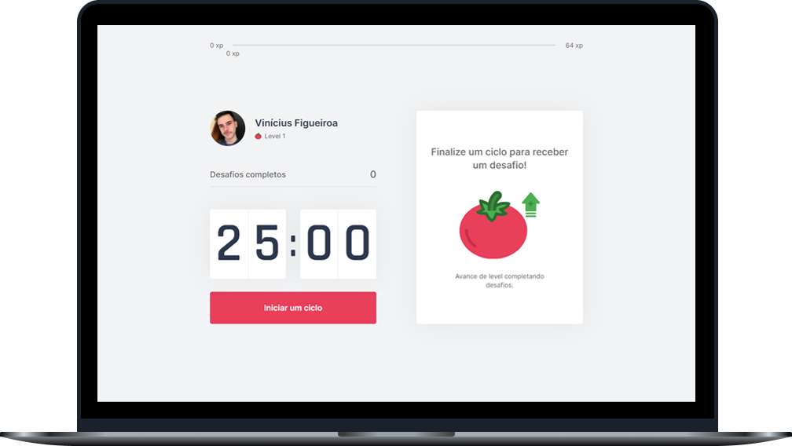

<h1 align="center">
  
</h1>
 
 

  

 

## Sobre o projeto 💬
O **Pomo.up** é uma aplicação web que combina a técnica de Pomodoro, que aumenta o foco e a produtividade, com exercícios físicos para o corpo e para os olhos, indicada para quem passa muito tempo em frente ao computador.

## Tecnologias 🛠
Desenvolvido utilizando as seguintes tecnologias:
* [React](https://reactjs.org)
* [Next.js](https://nextjs.org/)
* [TypeScript](https://www.typescriptlang.org/)

## Como utilizar? 📌
1) Clonar o projeto em sua máquina
`$ git clone https://github.com/vinixiii/Pomo.up`
2) Dentro da pasta do projeto, no prompt de comando, insira estes códigos
* Para instalar as dependências
`yarn`
* Para inicializar o app
`yarn dev`

*ou*

Acesse o **Pomo.up** no seu navegador! [Clique aqui](https://pomo-up.vercel.app/)

---

*Desenvolvido durante a **Next Level Week #4**, produzido pela [Rocketseat](https://github.com/Rocketseat)*

Feito por: [Vinícius Figueiroa](https://github.com/vinixiii) 🙋🏻‍♂️
